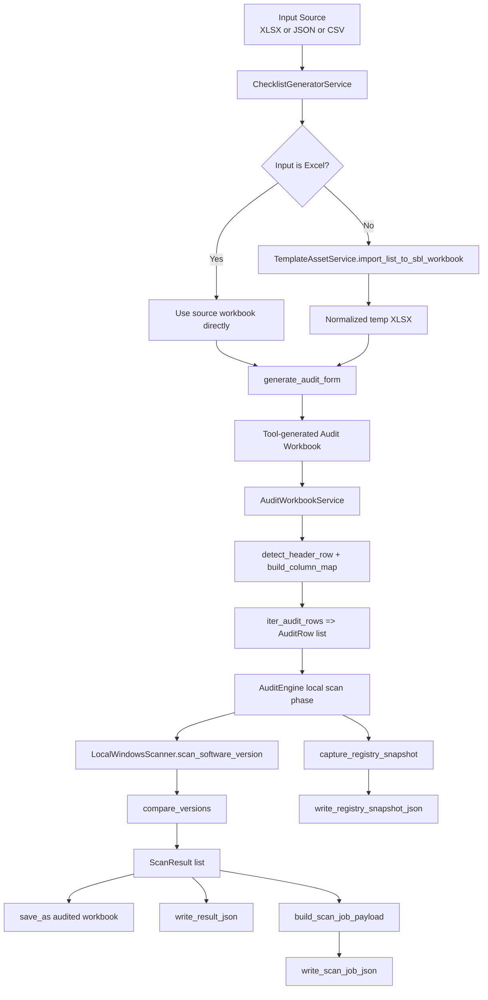
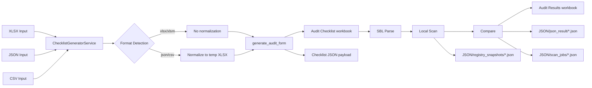

# AuditMatic Pipeline Data Flow

This document shows how data moves through the main pipelines in AuditMatic, what files are created, and what each stage is responsible for.

## 1) Intake Pipelines (XLSX, JSON, CSV)

### Source Inputs
- XLSX checklist source (example): `tests/Test SBLs/test_sbl.xlsx`
- JSON checklist source (example): `tests/Test SBLs/test_sbl.json`
- CSV checklist source: normalized from JSON rows during test run

### Fixture Scope Note
- `tests/Test SBLs/` holds SBL intake fixtures used for pipeline runs.
- `tests/Test Detection Rules/` is reference/record data for detection-rule examples and historical rule tracking, not an SBL intake source.

### Intake Flow
1. `ChecklistGeneratorService(source_path)` initializes intake.
2. `detect_workbook_format(source_path)` determines input type.
3. For JSON/CSV: `TemplateAssetService.import_list_to_sbl_workbook(...)` converts input into a normalized temporary XLSX.
4. `generate_audit_form(output_path)` copies values/styles and resets audit column values.
5. `export_json_payload()` emits parsed checklist payload (source info, target columns, rows).

### Data Produced
- Tool-generated audit workbook (XLSX)
- Checklist JSON payload (in-memory, optionally persisted)
- Normalized temporary XLSX for JSON/CSV intake

---

## 2) SBL Parse Pipeline

### Parser Components
- `AuditWorkbookService.detect_header_row()`
- `AuditWorkbookService.build_column_map()`
- `AuditWorkbookService.iter_audit_rows()`

### Parse Responsibilities
1. Detect required header row from workbook content.
2. Build a robust column map for required fields and target VM columns.
3. Infer target columns dynamically.
4. Emit `AuditRow` objects containing:
   - `software_component`
   - `current_ci_version`
   - `sbl_build_version`
   - `version_locations`
   - `target_vms`

### Data Produced
- Parsed row collection used by scan engine
- Build type and detected target column metadata

---

## 3) Local Scan Pipeline

### Scanner Components
- `LocalWindowsScanner.capture_registry_snapshot()`
- `LocalWindowsScanner.scan_software_version(...)`
- `VersionRuleResolver.detect_rule(version_location)`

### Rule-Based Scan Paths
1. `programs_and_features`:
   - Queries uninstall registry keys
   - Matches software by display name
2. `powershell`:
   - Executes command from version location rule payload
3. `file_version`:
   - Reads file version metadata from candidate file paths

### Data Produced
- Found version + scan status + scan details per software row
- Registry snapshot payload (`generated_at`, `host`, `platform`, `entries`, `entry_count`)

---

## 4) Compare Pipeline

### Comparison Components
- `compare_versions(expected, found, scan_status)`
- `AuditEngine._build_result(...)`

### Compare Behavior
1. If scan status is `WARN`, comparison returns `WARN` with `NOT_SCANNED` context.
2. Empty/not found versions return `FAIL`.
3. Exact normalized version match returns `PASS`.
4. Numeric version mismatch returns `FAIL` with relation context:
   - `LOWER_THAN_EXPECTED`
   - `HIGHER_THAN_EXPECTED`
   - `MISMATCH`

### Data Produced
- `ScanResult` entries with:
  - expected version
  - found version
  - final status (`PASS`/`FAIL`/`WARN`)
  - human-readable audit text

---

## 5) Output/Artifact Pipeline

### Output Components
- Workbook save via `AuditWorkbookService.save_as(...)`
- `JsonExportService.write_result_json(...)`
- `JsonExportService.write_registry_snapshot_json(...)`
- `JsonExportService.write_scan_job_json(...)`

### Artifact Locations
- Workbook results: `Audit Results/`
- Checklist workbook artifacts: `Audit Checklist/`
- JSON result artifacts: `JSON/json_result/`
- Registry snapshots: `JSON/registry_snapshots/`
- Scan jobs: `JSON/scan_jobs/`

### Auto-Recovery Examples
On app startup, `_create_example_files()` recreates missing example files individually if they were deleted:
- `example_registry_snapshot.json`
- `example_checklist.json`
- `example_result.json`
- `example_scan_job.json`
- `example_audit_checklist.xlsx`
- `example_audit_results.xlsx`

---

## 6) End-to-End Flow (High Level)

```text
Input (XLSX/JSON/CSV)
  -> ChecklistGeneratorService (normalize if needed)
  -> Tool-generated Audit Workbook
  -> AuditWorkbookService parse rows/targets
  -> AuditEngine local scan phase
  -> compare_versions for each row
  -> Workbook + JSON outputs (result, snapshot, scan job)
```

### Mermaid: End-to-End Execution



### Mermaid: Intake and Data Artifacts



---

## 7) Live Validation Results (2026-04-17)

### Multi-Format Pipeline Validation
All three intake formats were exercised through:
- intake normalization/generation
- SBL parse
- local scan
- compare

| Format | Parsed Rows | Engine Total | PASS | FAIL | WARN |
|---|---:|---:|---:|---:|---:|
| XLSX | 3 | 3 | 0 | 3 | 0 |
| JSON | 3 | 3 | 0 | 3 | 0 |
| CSV | 3 | 3 | 0 | 3 | 0 |

### Why FAIL counts are expected in this run
The local machine currently has versions newer/different than the test SBL baseline values (for example, 7-Zip and Notepad++), so comparison correctly marks them as `FAIL`.

---

## 8) Concrete Data Example (One Row)

1. Parsed row:
   - `software_component`: `7-Zip`
   - `sbl_build_version`: `23.01`
   - `version_locations`: `Programs and Features`
2. Local scan found:
   - `found_version`: `26.00.00.0`
3. Compare output:
   - status: `FAIL`
   - text: `FAIL | result=HIGHER_THAN_EXPECTED | expected=23.01 | found=26.00.00.0`

This is the expected behavior for strict baseline comparison.
